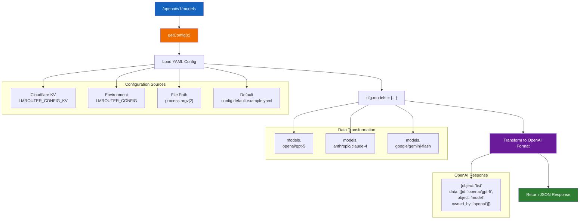
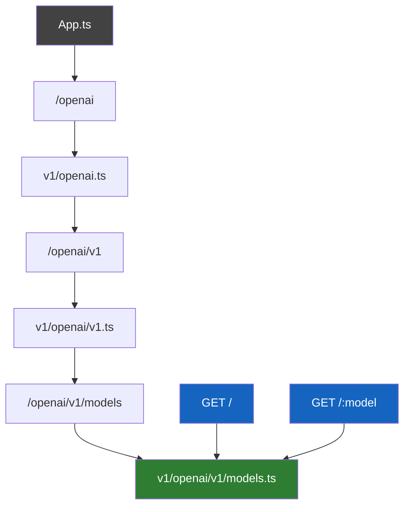
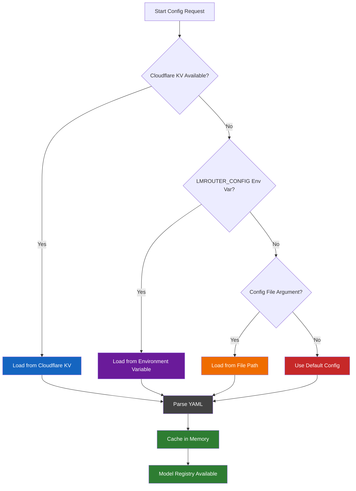
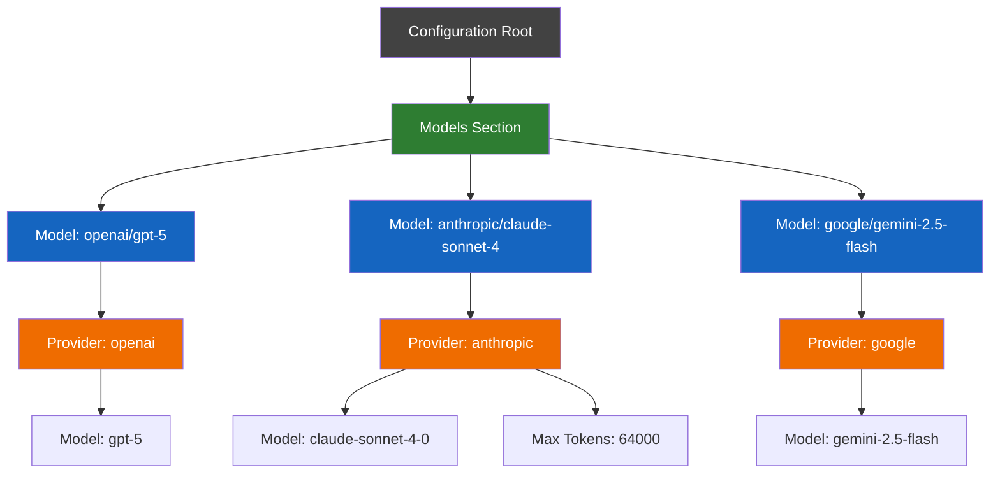

# OpenAI Models Endpoint Documentation

## Overview

The `GET /openai/v1/models` endpoint in LMRouter provides an OpenAI-compatible interface for listing available AI models. This endpoint serves as a discovery mechanism for clients to understand which models are available through the LMRouter service and how they map to underlying providers.

## High-Level Architecture



*Config gets loaded from multiple sources, parsed into cfg.models object, then transformed into OpenAI-compatible JSON response.*

## Route Hierarchy



*Routes are registered hierarchically through multiple router files, culminating in the models endpoint with list and retrieve operations.*

**Route Registration Flow:**
1. `src/app.ts:46` → `app.route("/openai", openaiRouter)`
2. `src/routes/v1/openai.ts:11` → `openaiRouter.route("/v1", openaiV1Router)`
3. `src/routes/v1/openai/v1.ts:20` → `openaiV1Router.route("/models", modelsRouter)`
4. `src/routes/v1/openai/v1/models.ts:34` → Handler endpoints

## Configuration System

### Configuration Loading Priority



*Configuration follows a priority order: Cloudflare KV → Environment Variable → File Path → Default Config, then gets parsed and cached for performance.*

### Configuration Implementation

**File**: `src/utils/config.ts:31-62`

The `getConfig(c)` function implements a priority-based configuration loading system:

1. **Cloudflare KV**: `c.env.LMROUTER_CONFIG_KV` and `c.env.LMROUTER_CONFIG_KV_KEY`
2. **Environment Variable**: `LMROUTER_CONFIG` (base64-encoded YAML)
3. **Command Line Argument**: `process.argv[2]` (file path)
4. **Default Config**: `config/config.default.example.yaml`

The system uses in-memory caching (`configCache`) to avoid repeated file parsing.

### Configuration Structure



*Configuration structure shows how models map to providers with specific settings, enabling flexible routing to different AI services.*

**Example Configuration** (`config/config.example.yaml:37-94`):
```yaml
models:
  openai/gpt-5:
    providers:
      - provider: openai
        model: gpt-5
  anthropic/claude-sonnet-4:
    providers:
      - provider: anthropic
        model: claude-sonnet-4-0
        max_tokens: 64000
  google/gemini-2.5-flash:
    providers:
      - provider: google
        model: gemini-2.5-flash
```

## Request Processing Flow

### Middleware Stack

**File**: `src/app.ts:19-35`

Requests pass through several middleware layers:

1. **Cloudflare KV Loader**: `loadConfigFromCloudflareKV(c)` - Loads config from Cloudflare KV storage
2. **Logger**: Hono logger middleware for request logging
3. **CORS**: Configures CORS based on authentication settings
4. **Authentication**: `auth` middleware (but models endpoint doesn't require auth)

### Route Handler Implementation

**File**: `src/routes/v1/openai/v1/models.ts:34-49`

```typescript
modelsRouter.get("/", (c) => {
  const cfg = getConfig(c);
  const models = Object.entries(cfg.models).map(([name, model]) => {
    return {
      id: name,
      object: "model",
      created: model.created ?? 0,
      owned_by: model.providers.map((provider) => provider.provider).join(", "),
    };
  });

  return c.json({
    object: "list",
    data: models,
  });
});
```

The handler:
1. Retrieves configuration using `getConfig(c)`
2. Transforms `cfg.models` object into OpenAI-compatible format
3. Returns JSON response with model list

### Individual Model Endpoint

**File**: `src/routes/v1/openai/v1/models.ts:11-32`

```typescript
modelsRouter.get("/:model{.+}", (c) => {
  const cfg = getConfig(c);
  const modelName = c.req.param("model");
  const model = cfg.models[modelName];
  if (!model) {
    return c.json(
      {
        error: {
          message: "Model not found",
        },
      },
      404,
    );
  }

  return c.json({
    id: modelName,
    object: "model",
    created: model.created ?? 0,
    owned_by: model.providers.map((provider) => provider.provider).join(", "),
  });
});
```

## Response Format

### List Models Response

```json
{
  "object": "list",
  "data": [
    {
      "id": "openai/gpt-5",
      "object": "model",
      "created": 0,
      "owned_by": "openai"
    },
    {
      "id": "anthropic/claude-sonnet-4",
      "object": "model",
      "created": 0,
      "owned_by": "anthropic"
    },
    {
      "id": "google/gemini-2.5-flash",
      "object": "model",
      "created": 0,
      "owned_by": "google"
    }
  ]
}
```

### Individual Model Response

```json
{
  "id": "openai/gpt-5",
  "object": "model",
  "created": 0,
  "owned_by": "openai"
}
```

### Error Response

```json
{
  "error": {
    "message": "Model not found"
  }
}
```

## Key Implementation Details

### Configuration Types

**File**: `src/types/config.ts`

The configuration uses TypeScript interfaces:

```typescript
export interface LMRouterConfigModel {
  name?: string;
  type?: LMRouterModelType;  // "language" | "image" | "embedding" | "audio"
  icon?: string;
  author?: string;
  description?: string;
  website?: string;
  created?: number;
  providers: LMRouterConfigModelProvider[];
}

export interface LMRouterConfigModelProvider {
  provider: string;
  model: string;
  context_window?: number;
  max_tokens?: number;
  responses_only?: boolean;
  pricing?: LMRouterConfigModelProviderPricing;
}
```

### Authentication System

**File**: `src/middlewares/auth.ts`

The auth middleware supports multiple authentication types:
- **BYOK**: "Bring Your Own Key" (`BYOK:your-key`)
- **Access Keys**: Pre-configured keys from `cfg.access_keys`
- **API Keys**: Database-backed API keys (when auth enabled)
- **Better Auth**: Session-based authentication

Note: The models endpoint doesn't require authentication, making it accessible for model discovery.

## Usage Examples

### Using requests.http

```http
### List Available Models (OpenAI)
GET {{baseUrl}}/openai/v1/models
Authorization: Bearer {{apiKey}}
```

### Using curl

```bash
# List all models
curl -X GET "http://localhost:3000/openai/v1/models" \
  -H "Authorization: Bearer your-api-key"

# Get specific model
curl -X GET "http://localhost:3000/openai/v1/models/openai/gpt-5" \
  -H "Authorization: Bearer your-api-key"
```

### Using JavaScript

```javascript
// List all models
const response = await fetch('http://localhost:3000/openai/v1/models', {
  headers: {
    'Authorization': 'Bearer your-api-key'
  }
});
const models = await response.json();

// Get specific model
const modelResponse = await fetch('http://localhost:3000/openai/v1/models/openai/gpt-5', {
  headers: {
    'Authorization': 'Bearer your-api-key'
  }
});
const model = await modelResponse.json();
```

## Architecture Benefits

1. **OpenAI Compatibility**: Provides the same interface as OpenAI's models endpoint
2. **Provider Abstraction**: Clients don't need to know about underlying providers
3. **Dynamic Configuration**: Models can be added/removed without code changes
4. **Multi-Runtime Support**: Works in both Node.js and Cloudflare Workers
5. **Caching**: Configuration is cached for performance
6. **Flexible Authentication**: Multiple auth methods supported

## Error Handling

The endpoint implements proper error handling:
- **404 Not Found**: Returned when a specific model doesn't exist
- **500 Internal Server Error**: Returned for configuration parsing errors
- **CORS Errors**: Handled by the CORS middleware

## Performance Considerations

1. **Configuration Caching**: Config is loaded once and cached in memory
2. **Minimal Processing**: Simple object transformation with low overhead
3. **No External Dependencies**: Doesn't call external APIs
4. **Memory Efficient**: Only processes necessary model metadata

## Related Components

- **Adapters**: The models exposed by this endpoint are used by the adapter system for actual API calls
- **Other Endpoints**: Similar pattern is used for other OpenAI-compatible endpoints (`/chat`, `/images`, etc.)
- **Configuration System**: Shared with all other endpoints in the application